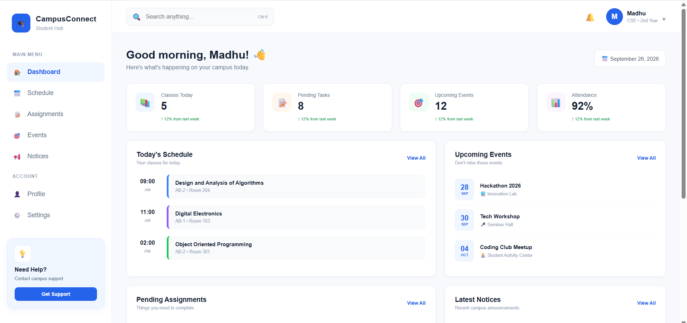
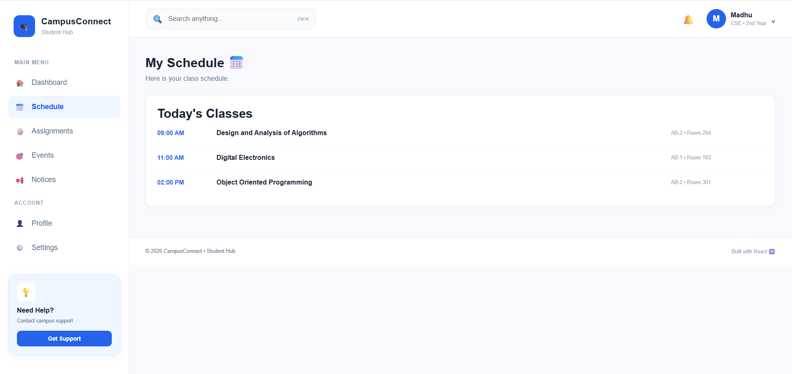
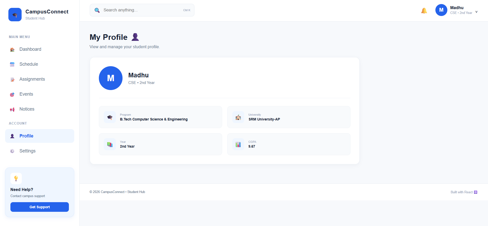

# CampusConnect 🎓

CampusConnect is a modern student campus hub built with React and Vite.

It provides students with a single place to view their schedule, assignments, campus events, notices, attendance, profile, and settings.

## 🚀 Features

- 📊 Student dashboard
- 📅 Class schedule
- 📝 Assignment tracking
- 🎯 Campus events
- 📢 Campus notices
- 📊 Attendance tracking
- 👤 Student profile
- ⚙️ Settings
- 🔍 Search navigation
- 📱 Responsive design
- 🧭 React Router navigation

## 🛠️ Tech Stack

- React
- JavaScript
- Vite
- React Router
- HTML
- CSS

## 📂 Project Structure

```text
src/
├── components/
│   ├── Navbar.jsx
│   ├── Sidebar.jsx
│   └── StatCard.jsx
├── pages/
│   ├── Schedule.jsx
│   ├── Assignments.jsx
│   ├── Events.jsx
│   ├── Notices.jsx
│   ├── Profile.jsx
│   ├── Settings.jsx
│   └── Attendance.jsx
├── App.jsx
├── index.css
└── main.jsx
## 📸 Screenshots

### Dashboard


### Schedule

###Profile

